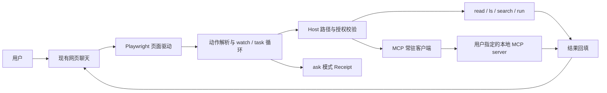

# Chat2Local：项目介绍与技术取舍

## 一分钟介绍

Chat2Local 让用户继续使用熟悉的网页聊天，同时让模型能受控地请求本地项目工具。它用 Playwright 驱动独立浏览器，把模型回复中的结构化动作交给本地 Node.js Host；Host 校验路径和授权，执行读取、搜索、列目录、运行测试或用户选定的 MCP 工具，再把结果送回同一段对话。项目重点是**网页模型与本地工具之间的执行边界**，以及调用结果不明时如何避免静默重放。

适合用于介绍 AI Agent／工具工程，也能展示 Node.js 进程管理、状态恢复、故障测试和安全边界设计。项目由郑焱文设计、验收，并借助 AI 协作实现代码；面试时应结合自己实际参与的设计、调试和验证工作说明贡献。

## 一张图看调用链



- [页面驱动](../src/page-driver.mjs)与[站点选择器](../src/sites.mjs)负责网页适配；站点变化主要更新选择器。
- [单轮循环](../src/loop.mjs)与[旁观执行](../src/watcher.mjs)分别处理主动派任务和网页上的连续对话；两者共用动作协议与 Host。
- [Host 动作](../src/host-actions.mjs)实施路径、敏感文件、超时及输出限制；[MCP 客户端](../src/mcp-client.mjs)维护每次 watch 独享的 stdio 会话。

## 四个值得讲清的工程决策

| 决策 | 遇到的问题 | 实现与可核对证据 |
| --- | --- | --- |
| 沿用现有网页聊天 | 用户已有账号和对话，不想配置另一套模型前端 | 专用浏览器 + 页面协议；[无账号 mock 演示](SHOWCASE.md)复现完整动作链。真实站点的 DOM 变化仍需维护适配器。 |
| 工具能力由 Host 授权 | 模型提出的动作不能直接变成本机命令 | Host Root 路径检查、工具目录即 MCP 允许列表，写入类工具按会话模式审批（默认逐笔）；见[动作实现](../src/host-actions.mjs)、[写入门控](../src/write-gate.mjs)及相应测试。 |
| 会话状态与失败语义分开 | 浏览器 MCP 等工具需要跨调用保留页面；超时后不能断言工具没有执行 | 每次 watch 复用一个 MCP 连接；明确工具错误可继续，已发请求结果不明则停止批次和回填、保留待核对断点；见[常驻测试](../tests/mcp-resident.test.mjs)和[现场记录](runs/P48-field-run.md)。 |
| 验证分层 | 单测通过不能证明真实网页模型会自行选择工具 | fixture 故障测试、五项 mock 浏览器冒烟、真实模型现场记录分别标注；第二个独立浏览器 server 的[兼容记录](runs/P50-cross-server-field-run.md)验证桥接不依赖单一工具目录。 |

## 面试演示路径

在 Windows、Node.js 20+ 环境中运行：

```powershell
npm ci
npx playwright install chromium
npm run demo
```

演示使用本地模拟聊天页，无需聊天网站账号或 API Key。它顺次展示 `ls → read → run`、故障诊断中的 `search → read → run`，以及文本目录问答的来源行号；看到三条 `SMOKE ... PASSED` 即表示这三条 mock 链路完成。步骤和边界见[展示与复现说明](SHOWCASE.md)。

如果面试官想看实现，可从[协议解析](../src/parse.mjs)追踪到[Host 动作](../src/host-actions.mjs)，再看[旁观断点](../src/watch-checkpoint.mjs)如何阻止中断后自动重放。真实浏览器 MCP 场景可展示已脱敏的[Playwright 记录](runs/P48-field-run.md)：同一页面内存标记和展开状态跨调用、暂停与恢复保留。

## 已验证范围与限制

| 证据 | 能说明什么 | 不能据此说明什么 |
| --- | --- | --- |
| `npm test` 与五项 `smoke` | 本机回归和 mock 浏览器链路 | 所有真实聊天站点当下仍兼容 |
| [P48 现场记录](runs/P48-field-run.md) | 当时的真实网页模型自行构造浏览器 MCP 调用，页面状态连续 | 任意 MCP server 均兼容、握手次数被独立测量 |
| [P50 现场记录](runs/P50-cross-server-field-run.md) | 第二个独立 server 通过同类任务 | 远程 MCP、多 server 同时连接 |

`run` 会以当前操作系统用户身份执行获准脚本；Host Root 路径检查不是进程隔离。MCP 只验证过本地 stdio、单 server、串行文本结果工具。近期的写入分级审批与线程摘要有单测和 mock 冒烟，真实网站完整链路仍待现场验证；介绍时应分别报告。

## 面试时可展开的问题

1. **为什么不直接用模型 API？** 本项目要连接用户已有的网页聊天；代价是页面选择器需要维护。因此用纯数据的站点配置隔离 DOM 差异，并保留无账号 mock 测试。
2. **为什么 MCP 超时后不自动重试？** 请求可能已经在 server 执行；重试写入或点击会造成重复副作用。Host 把这类结果标为需人工确认，停止后续动作，断点只记录最小状态。
3. **如何避免“演示成功”被误当作“通用兼容”？** 单测、mock 冒烟、脚本生成动作和真实模型现场任务分开记录；真实记录保留调用顺序与页面状态证据，也写明未独立测量的项目。

简历中可概括为：**设计并验收面向现有网页聊天的本地 Agent 工具桥接，完成 Host 授权、MCP 常驻会话、结果不明断点和分级写入审批；建立单测、浏览器冒烟及真实模型现场任务的分层验证。** 根据本人实际贡献调整措辞；不要把 AI 协作实现描述成独立手写。
